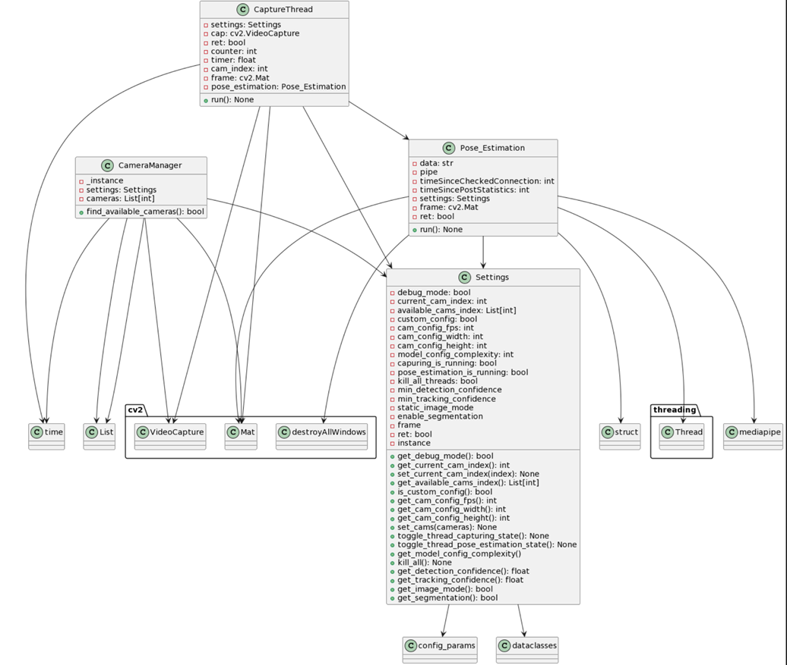
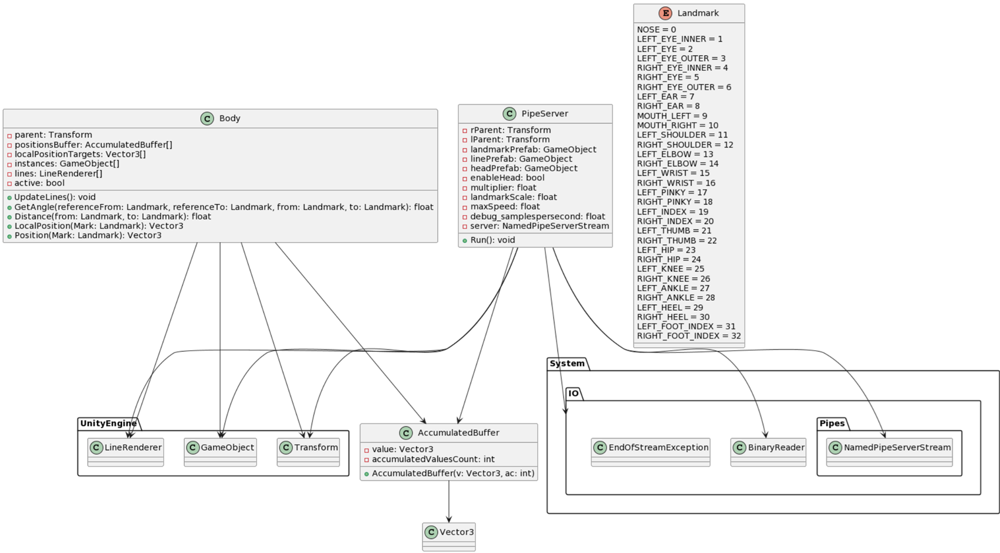
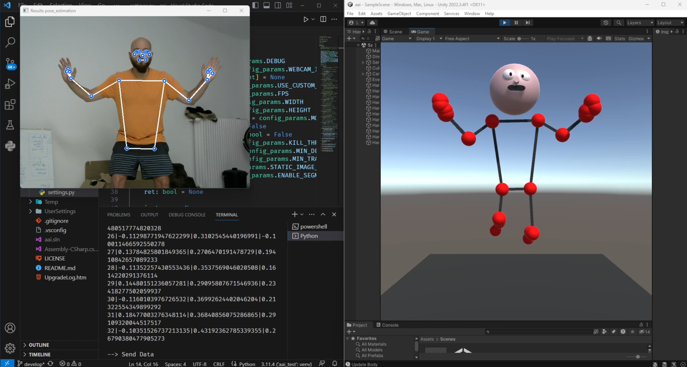

  <!-- PROJECT LOGO -->
 

  

<h3 align="center">
Realtime Motion Capturing in Unity Engine

  

     
     
    <a href="https://github.com/Lakusan/rt_motion_cap_unity/blob/main/aai_presentation.pdf"><strong>View Presentation »</strong></a>

<!-- ABOUT THE PROJECT -->
## About The Project

     
    

   This application was developed during the Module Applied Artificial Intelligence as part of my Master Degree in Applied Computer Science at SRH University Heidelberg, in July 2023.
    

    

    Python scripts are used to process live video stream from webcam.
Mediapipe is used to process the images and extract a humans pose.
NamedPipeServerStream is used on the server in unity to get data from python scripts.
MediaPipes Pose data is then translated to unity coords.
Representation of the joints is then shown with primitives in unity.

<section style="display: grid; grid-template-columns: 1fr; gap: 20px; text-align: start;">
    

        <h3>Scanning</h3>
        <ul>
            <li style="padding: 5px; margin: 5px;">Real-time generation of Meshes (yellow)</li>
            <li style="padding: 5px; margin: 5px;">Dynamic NavMesh Generation (green)</li>
            <li style="padding: 5px; margin: 5px;">Anchor Placement as Navigation Target (green cube)</li>
        </ul>
    

    

        </img>
    

        

        <h3>Scanning</h3>
        <ul>
            <li style="padding: 5px; margin: 5px;">Real-time generation of Meshes (yellow)</li>
            <li style="padding: 5px; margin: 5px;">Dynamic NavMesh Generation (green)</li>
            <li style="padding: 5px; margin: 5px;">Anchor Placement as Navigation Target (green cube)</li>
        </ul>
    

    

        </img>
    

        

        </img>
    

        

        <h3>Scanning</h3>
        <ul>
            <li style="padding: 5px; margin: 5px;">Real-time generation of Meshes (yellow)</li>
            <li style="padding: 5px; margin: 5px;">Dynamic NavMesh Generation (green)</li>
            <li style="padding: 5px; margin: 5px;">Anchor Placement as Navigation Target (green cube)</li>
        </ul>
    

</section>

<!-- Dependencies -->
## Dependencies

* Unity Engine 2022.3.4f1 LTS
* python 3.11.4
* numpy-1.25.1 
* opencv-python-4.8.0.74
* mediapipe 0.10.2

<!-- Setup -->
## Setup
- clone project
- in python_scripts install dependencies [$ pip install -r requirements.txt]

<!-- USAGE EXAMPLES -->
## Usage
1. Python
    - set config_params
    - start main.py
2. Unity
    - start unity project and open sample scene
    - hit play
 

<!-- LICENSE -->
## License
Distributed under the MIT License. See `LICENSE.txt` for more information.
 

<!-- CONTACT -->
## Contact

* Project Link: [https://github.com/Lakusan/invisnav](https://github.com/Lakusan/invisnav)
* [![LinkedIn][linkedin-shield]][linkedin-url]

<!-- MARKDOWN LINKS & IMAGES -->
[linkedin-shield]: https://img.shields.io/badge/-LinkedIn-black.svg?style=for-the-badge&logo=linkedin&colorB=555
[linkedin-url]: https://www.linkedin.com/in/lakusan
